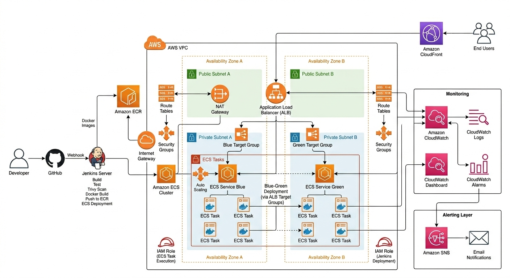

# Architecture Documentation

## Overview

This project implements a production-grade cloud-native CI/CD platform on AWS using Jenkins, Terraform, Docker, Amazon ECS Fargate, ECR, ALB, CloudFront, CloudWatch, and SNS.

The platform automates infrastructure provisioning, application deployment, monitoring, scaling, rollback, and alerting while following modern DevOps and cloud-native engineering practices.

---

## Architecture Diagram



---

## High-Level Architecture

```text
Developer
    │
    ▼
GitHub Repository
    │
    ▼
GitHub Webhook
    │
    ▼
Jenkins Pipeline
    │
    ├── Build
    ├── Test
    ├── Security Scan
    ├── Docker Build
    ├── Push To ECR
    └── Deploy To ECS
    │
    ▼
Amazon ECS Fargate
    │
    ▼
Application Load Balancer
    │
    ▼
CloudFront
    │
    ▼
Users

CloudWatch
    │
    ▼
SNS Alerts
```

---

## Network Architecture

The platform uses a dedicated VPC with public and private subnets.

### Public Subnets

Resources:

- Application Load Balancer
- NAT Gateway

Purpose:

- Internet-facing access
- Traffic entry point

### Private Subnets

Resources:

- ECS Fargate Tasks

Purpose:

- Secure workload execution
- No direct internet access

---

## VPC Design

```text
VPC
│
├── Public Subnet A
├── Public Subnet B
│
├── Private Subnet A
└── Private Subnet B
```

Benefits:

- Isolation
- Security
- Controlled communication

---

## Container Platform

### Amazon ECR

Stores Docker images generated by Jenkins.

Responsibilities:

- Image versioning
- Artifact storage
- Secure image distribution

### Amazon ECS Fargate

Runs containerized workloads.

Responsibilities:

- Task scheduling
- Service management
- Self-healing
- Container orchestration

---

## Blue-Green Deployment Design

Two ECS services are maintained.

```text
Blue Environment

Green Environment
```

Deployment Flow:

```text
Deploy Green
      │
      ▼
Validate
      │
      ▼
Approval
      │
      ▼
Switch Traffic
```

Benefits:

- Zero downtime
- Safer deployments
- Easier rollback

---

## Load Balancer Design

Application Load Balancer manages traffic routing.

Responsibilities:

- Health checks
- Traffic distribution
- Blue-Green switching

Target Groups:

```text
Blue Target Group

Green Target Group
```

---

## Monitoring Design

CloudWatch provides centralized observability.

Monitored Services:

- ECS
- ALB
- CloudFront
- Infrastructure

Metrics:

- CPU Utilization
- Memory Utilization
- Request Count
- Response Time
- Error Rates

---

## Alerting Design

CloudWatch Alarms integrate with SNS.

Workflow:

```text
CloudWatch Metric
       │
       ▼
CloudWatch Alarm
       │
       ▼
SNS Topic
       │
       ▼
Email Notification
```

Alert Categories:

- Infrastructure Alerts
- Deployment Alerts
- ECS Alerts
- ALB Alerts

---

## Auto Scaling Design

ECS Service Auto Scaling is configured using:

- CPU Utilization
- Memory Utilization

Scaling Flow:

```text
Traffic Increase
       │
       ▼
CPU Increase
       │
       ▼
Scale Out
```

Benefits:

- Cost optimization
- Performance stability

---

## CloudFront Design

CloudFront sits in front of the ALB.

```text
User
 │
 ▼
CloudFront
 │
 ▼
ALB
 │
 ▼
ECS
```

Benefits:

- Reduced latency
- Edge caching
- Global delivery

---

## Key Architecture Decisions

| Decision | Reason |
|-----------|----------|
| Terraform | Infrastructure as Code |
| Jenkins | Flexible CI/CD automation |
| ECS Fargate | Serverless containers |
| Blue-Green | Safer deployments |
| CloudWatch | Native monitoring |
| SNS | Incident notifications |
| CloudFront | Global performance |

---

## Summary

The architecture provides Infrastructure as Code, CI/CD automation, Blue-Green deployments, automated rollback, secure networking, auto scaling, monitoring, alerting, and content delivery using AWS cloud-native services.